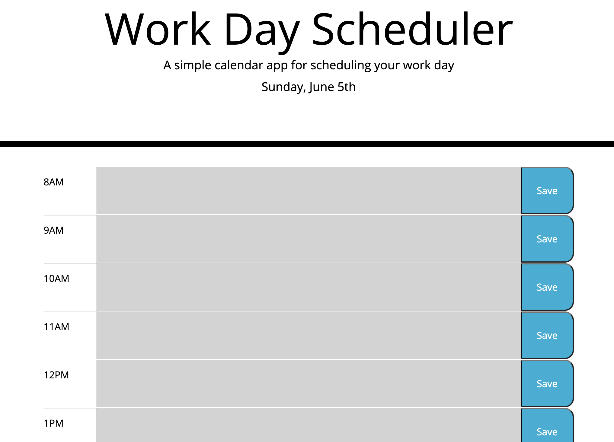

# Third-Party APIs Challenge: Work Day Scheduler

## **Description**
The purpose of this project was to create a simple work day scheduler/calendar that gives the user the ability to save events for each hour of the day. 

**Link to deployed Github page ➝** [https://abbygraves.github.io/5-work-day-scheduler/](https://abbygraves.github.io/5-work-day-scheduler/)

 

## **Built With:**
+ Dynamically Updated HTML
+ CSS
+ Bootstrap
+ jQuery
+ JavaScript
+ Moment.js 

 

## **What I Did**
+ Displayed the current day/date at the top of the page and implemented moment.js functionality to automatically update it according to the day/date the user is viewing the page
+ Created timeblocks that allow the user to input information/events with the intent of completing said task by the time listed 
+ Used jQuery to implement color coding organization based on time of day 
+ Used moment.js functionality to ensure the webpage recoginizes the current time of day
+ Implemented event listeners to execute functions such as saving data to localStoarge when the "Save" `<button>` is clicked
+ Upon page refresh, the previously saved information/events persist

